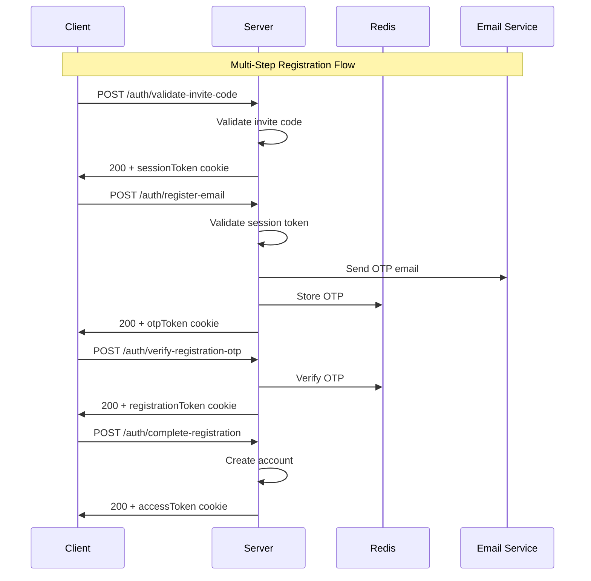

# Authentication API Documentation

## Overview

This document provides comprehensive API documentation for the Empty Space authentication system. The system implements a secure, multi-step registration flow with enterprise-grade security features including progressive rate limiting, CSRF protection, JWT-based authentication, and comprehensive audit logging.

## Base Configuration

- **Base URL**: `http://localhost:12001/api/v1/website`
- **Admin Base URL**: `http://localhost:12001/admin`
- **Content-Type**: `application/json`
- **Authentication**: JWT tokens via HTTP-only cookies
- **CORS**: Enabled with credentials support

## Security Features

### Rate Limiting
- **Invite Code Validation**: 5 attempts per 15 minutes
- **Email Registration**: 3 attempts per 15 minutes  
- **OTP Verification**: 3 attempts per 10 minutes
- **Registration Completion**: 3 attempts per 15 minutes
- **Login**: 5 attempts per 15 minutes
- **Password Reset**: 3 requests per hour

### CSRF Protection
- Required for all state-changing operations
- Token provided via `X-CSRF-Token` header
- Cookie-based token validation

### Cookie Security
- HTTP-only cookies for sensitive tokens
- Secure flag in production
- SameSite protection
- Domain-specific configuration

## Authentication Flow Overview



## API Endpoints

### 1. Registration Flow

#### 1.1 Validate Invite Code
**Endpoint**: `POST /auth/validate-invite-code`

**Description**: Validates an employee invite code and initiates the registration session.

**Rate Limit**: 5 attempts per 15 minutes per IP

**Request Headers**:
```http
Content-Type: application/json
```

**Request Body**:
```json
{
  "inviteCode": "string" // Format: $INV-YYYY-XXXXXX
}
```

**Validation Rules**:
- `inviteCode`: Required, must match pattern `^\$INV-\d{4}-[A-Za-z0-9]{6}$`

**Success Response** (200):
```json
{
  "data": {
    "message": "Invite code validated successfully",
    "sessionToken": "jwt_session_token",
    "inviteDetails": {
      "companyName": "Empty Space",
      "departmentName": "Engineering",
      "positionTitle": "Software Developer"
    }
  },
  "meta": {
    "timestamp": "2025-09-17T12:00:00.000Z",
    "requestId": "uuid-v4"
  }
}
```

**Cookies Set**:
```http
Set-Cookie: sessionToken=jwt_token; HttpOnly; Secure; SameSite=Strict; Max-Age=900; Path=/
```

**Error Responses**:

*400 - Validation Error*:
```json
{
  "error": {
    "code": 70000,
    "message": "Invalid invite code format",
    "type": "VALIDATION_ERROR",
    "timestamp": "2025-09-17T12:00:00.000Z",
    "requestId": "uuid-v4",
    "details": {
      "field": "inviteCode"
    }
  }
}
```

*404 - Invite Code Not Found*:
```json
{
  "error": {
    "code": 13000,
    "message": "Invite code not found or expired",
    "type": "INVITE_CODE_NOT_FOUND",
    "timestamp": "2025-09-17T12:00:00.000Z",
    "requestId": "uuid-v4"
  }
}
```

*409 - Invite Code Already Used*:
```json
{
  "error": {
    "code": 13001,
    "message": "Invite code has already been used",
    "type": "INVITE_CODE_USED",
    "timestamp": "2025-09-17T12:00:00.000Z",
    "requestId": "uuid-v4"
  }
}
```

*429 - Rate Limit Exceeded*:
```json
{
  "error": {
    "code": 4200,
    "message": "Too many requests. Please try again in 15 minutes.",
    "type": "RATE_LIMIT_EXCEEDED",
    "timestamp": "2025-09-17T12:00:00.000Z",
    "requestId": "uuid-v4",
    "details": {
      "retryAfter": 900,
      "maxAttempts": 5,
      "remainingAttempts": 0
    }
  }
}
```

#### 1.2 Register Email
**Endpoint**: `POST /auth/register-email`

**Description**: Registers user email and sends OTP for verification.

**Rate Limit**: 3 attempts per 15 minutes per email/IP

**Request Headers**:
```http
Content-Type: application/json
Cookie: sessionToken=jwt_session_token
```

**Request Body**:
```json
{
  "email": "user@example.com",
  "firstName": "John",
  "lastName": "Doe"
}
```

**Validation Rules**:
- `email`: Required, valid email format, max 254 characters, lowercase
- `firstName`: Required, 1-50 characters, letters/spaces/hyphens/apostrophes only
- `lastName`: Required, 1-50 characters, letters/spaces/hyphens/apostrophes only

**Success Response** (200):
```json
{
  "data": {
    "message": "OTP sent to email successfully",
    "email": "user@example.com",
    "otpExpiresIn": 600
  },
  "meta": {
    "timestamp": "2025-09-17T12:00:00.000Z",
    "requestId": "uuid-v4"
  }
}
```

**Cookies Set**:
```http
Set-Cookie: otpToken=jwt_otp_token; HttpOnly; Secure; SameSite=Strict; Max-Age=600; Path=/
```

**Error Responses**:

*400 - Invalid Session Token*:
```json
{
  "error": {
    "code": 4200,
    "message": "Invalid or expired session token",
    "type": "INVALID_SESSION_TOKEN",
    "timestamp": "2025-09-17T12:00:00.000Z",
    "requestId": "uuid-v4"
  }
}
```

*409 - Email Already Exists*:
```json
{
  "error": {
    "code": 2002,
    "message": "Account with this email already exists",
    "type": "USER_ALREADY_EXISTS",
    "timestamp": "2025-09-17T12:00:00.000Z",
    "requestId": "uuid-v4"
  }
}
```

#### 1.3 Verify Registration OTP
**Endpoint**: `POST /auth/verify-registration-otp`

**Description**: Verifies the OTP sent to user's email during registration.

**Rate Limit**: 3 attempts per 10 minutes per email/IP

**Request Headers**:
```http
Content-Type: application/json
Cookie: otpToken=jwt_otp_token
```

**Request Body**:
```json
{
  "otp": "123456"
}
```

**Validation Rules**:
- `otp`: Required, exactly 6 digits, numeric only

**Success Response** (200):
```json
{
  "data": {
    "message": "OTP verified successfully",
    "registrationToken": "jwt_registration_token"
  },
  "meta": {
    "timestamp": "2025-09-17T12:00:00.000Z",
    "requestId": "uuid-v4"
  }
}
```

**Cookies Set**:
```http
Set-Cookie: registrationToken=jwt_registration_token; HttpOnly; Secure; SameSite=Strict; Max-Age=900; Path=/
```

**Error Responses**:

*400 - Invalid OTP Token*:
```json
{
  "error": {
    "code": 4017,
    "message": "Invalid or expired OTP token",
    "type": "INVALID_OTP_TOKEN",
    "timestamp": "2025-09-17T12:00:00.000Z",
    "requestId": "uuid-v4"
  }
}
```

*400 - Invalid OTP*:
```json
{
  "error": {
    "code": 4002,
    "message": "Invalid OTP code",
    "type": "INVALID_OTP",
    "timestamp": "2025-09-17T12:00:00.000Z",
    "requestId": "uuid-v4"
  }
}
```

*400 - OTP Expired*:
```json
{
  "error": {
    "code": 4001,
    "message": "OTP has expired",
    "type": "OTP_EXPIRED",
    "timestamp": "2025-09-17T12:00:00.000Z",
    "requestId": "uuid-v4"
  }
}
```

#### 1.4 Complete Registration
**Endpoint**: `POST /auth/complete-registration`

**Description**: Completes the registration process by setting password and optional phone number.

**Rate Limit**: 3 attempts per 15 minutes per registration token

**Request Headers**:
```http
Content-Type: application/json
Cookie: registrationToken=jwt_registration_token
```

**Request Body**:
```json
{
  "password": "SecurePass123!",
  "phoneNumber": "+1234567890"
}
```

**Validation Rules**:
- `password`: Required, 8-128 characters, must contain uppercase, lowercase, number, and special character
- `phoneNumber`: Optional, E.164 format (e.g., +1234567890)

**Success Response** (200):
```json
{
  "data": {
    "message": "Registration completed successfully",
    "user": {
      "id": "user_id",
      "email": "user@example.com",
      "firstName": "John",
      "lastName": "Doe",
      "accountRole": "EMPLOYEE",
      "isActive": true,
      "isVerified": true
    },
    "accessToken": "jwt_access_token"
  },
  "meta": {
    "timestamp": "2025-09-17T12:00:00.000Z",
    "requestId": "uuid-v4"
  }
}
```

**Cookies Set**:
```http
Set-Cookie: accessToken=jwt_access_token; HttpOnly; Secure; SameSite=Strict; Max-Age=900; Path=/
Set-Cookie: refreshToken=jwt_refresh_token; HttpOnly; Secure; SameSite=Strict; Max-Age=604800; Path=/
```

**Error Responses**:

*400 - Invalid Registration Token*:
```json
{
  "error": {
    "code": 4009,
    "message": "Invalid or expired registration token",
    "type": "INVALID_TOKEN",
    "timestamp": "2025-09-17T12:00:00.000Z",
    "requestId": "uuid-v4"
  }
}
```

*400 - Weak Password*:
```json
{
  "error": {
    "code": 70000,
    "message": "Password must contain uppercase, lowercase, number, and special character",
    "type": "VALIDATION_ERROR",
    "timestamp": "2025-09-17T12:00:00.000Z",
    "requestId": "uuid-v4",
    "details": {
      "field": "password"
    }
  }
}
```

### 2. Authentication

#### 2.1 User Login
**Endpoint**: `POST /auth/login`

**Description**: Authenticates a user with email and password.

**Rate Limit**: 5 attempts per 15 minutes per email/IP

**Request Headers**:
```http
Content-Type: application/json
```

**Request Body**:
```json
{
  "email": "user@example.com",
  "password": "SecurePass123!"
}
```

**Validation Rules**:
- `email`: Required, valid email format, max 254 characters, lowercase
- `password`: Required, 1-128 characters, no null characters

**Success Response** (200):
```json
{
  "data": {
    "message": "Login successful",
    "user": {
      "id": "user_id",
      "email": "user@example.com",
      "firstName": "John",
      "lastName": "Doe",
      "accountRole": "EMPLOYEE",
      "isActive": true,
      "isVerified": true
    },
    "accessToken": "jwt_access_token"
  },
  "meta": {
    "timestamp": "2025-09-17T12:00:00.000Z",
    "requestId": "uuid-v4"
  }
}
```

**Cookies Set**:
```http
Set-Cookie: accessToken=jwt_access_token; HttpOnly; Secure; SameSite=Strict; Max-Age=900; Path=/
Set-Cookie: refreshToken=jwt_refresh_token; HttpOnly; Secure; SameSite=Strict; Max-Age=604800; Path=/
```

**Error Responses**:

*400 - Invalid Credentials*:
```json
{
  "error": {
    "code": 4003,
    "message": "Invalid email or password",
    "type": "INVALID_CREDENTIALS",
    "timestamp": "2025-09-17T12:00:00.000Z",
    "requestId": "uuid-v4"
  }
}
```

*423 - Account Locked*:
```json
{
  "error": {
    "code": 4021,
    "message": "Account temporarily locked due to multiple failed login attempts",
    "type": "ACCOUNT_LOCKED",
    "timestamp": "2025-09-17T12:00:00.000Z",
    "requestId": "uuid-v4",
    "details": {
      "retryAfter": 1800
    }
  }
}
```

#### 2.2 Refresh Token
**Endpoint**: `POST /auth/refresh`

**Description**: Refreshes the access token using the refresh token.

**Request Headers**:
```http
Content-Type: application/json
Cookie: refreshToken=jwt_refresh_token
```

**Success Response** (200):
```json
{
  "data": {
    "accessToken": "new_jwt_access_token"
  },
  "meta": {
    "timestamp": "2025-09-17T12:00:00.000Z",
    "requestId": "uuid-v4"
  }
}
```

**Cookies Set**:
```http
Set-Cookie: accessToken=new_jwt_access_token; HttpOnly; Secure; SameSite=Strict; Max-Age=900; Path=/
```

**Error Responses**:

*401 - Invalid Refresh Token*:
```json
{
  "error": {
    "code": 4007,
    "message": "Invalid or expired refresh token",
    "type": "EXPIRED_REFRESH_TOKEN",
    "timestamp": "2025-09-17T12:00:00.000Z",
    "requestId": "uuid-v4"
  }
}
```

#### 2.3 Logout
**Endpoint**: `POST /auth/logout`

**Description**: Logs out the user and invalidates tokens.

**Request Headers**:
```http
Content-Type: application/json
Cookie: accessToken=jwt_access_token; refreshToken=jwt_refresh_token
```

**Success Response** (200):
```json
{
  "data": {
    "message": "Logout successful"
  },
  "meta": {
    "timestamp": "2025-09-17T12:00:00.000Z",
    "requestId": "uuid-v4"
  }
}
```

**Cookies Cleared**:
```http
Set-Cookie: accessToken=; HttpOnly; Secure; SameSite=Strict; Max-Age=0; Path=/
Set-Cookie: refreshToken=; HttpOnly; Secure; SameSite=Strict; Max-Age=0; Path=/
```

### 3. Password Reset Flow

#### 3.1 Request Password Reset
**Endpoint**: `POST /auth/request-password-reset`

**Description**: Initiates password reset process by sending OTP to user's email.

**Rate Limit**: 3 requests per hour per email/IP

**Request Headers**:
```http
Content-Type: application/json
```

**Request Body**:
```json
{
  "email": "user@example.com"
}
```

**Validation Rules**:
- `email`: Required, valid email format, max 254 characters, lowercase

**Success Response** (200):
```json
{
  "data": {
    "message": "Password reset OTP sent to email",
    "email": "user@example.com",
    "otpExpiresIn": 600
  },
  "meta": {
    "timestamp": "2025-09-17T12:00:00.000Z",
    "requestId": "uuid-v4"
  }
}
```

**Cookies Set**:
```http
Set-Cookie: otpToken=jwt_otp_token; HttpOnly; Secure; SameSite=Strict; Max-Age=600; Path=/
```

**Error Responses**:

*404 - User Not Found*:
```json
{
  "error": {
    "code": 2001,
    "message": "No account found with this email address",
    "type": "USER_NOT_FOUND",
    "timestamp": "2025-09-17T12:00:00.000Z",
    "requestId": "uuid-v4"
  }
}
```

#### 3.2 Verify Password Reset OTP
**Endpoint**: `POST /auth/verify-password-reset-otp`

**Description**: Verifies the OTP sent for password reset.

**Rate Limit**: 3 attempts per 10 minutes per email/IP

**Request Headers**:
```http
Content-Type: application/json
Cookie: otpToken=jwt_otp_token
```

**Request Body**:
```json
{
  "email": "user@example.com",
  "otp": "123456"
}
```

**Validation Rules**:
- `email`: Required, valid email format, max 254 characters, lowercase
- `otp`: Required, exactly 6 digits, numeric only

**Success Response** (200):
```json
{
  "data": {
    "message": "OTP verified successfully",
    "resetToken": "jwt_reset_token"
  },
  "meta": {
    "timestamp": "2025-09-17T12:00:00.000Z",
    "requestId": "uuid-v4"
  }
}
```

**Cookies Set**:
```http
Set-Cookie: resetToken=jwt_reset_token; HttpOnly; Secure; SameSite=Strict; Max-Age=900; Path=/
```

**Error Responses**:

*400 - Invalid OTP*:
```json
{
  "error": {
    "code": 4002,
    "message": "Invalid OTP code",
    "type": "INVALID_OTP",
    "timestamp": "2025-09-17T12:00:00.000Z",
    "requestId": "uuid-v4"
  }
}
```

#### 3.3 Complete Password Reset
**Endpoint**: `POST /auth/complete-password-reset`

**Description**: Completes password reset with new password.

**Rate Limit**: 3 attempts per 15 minutes per reset token

**Request Headers**:
```http
Content-Type: application/json
Cookie: resetToken=jwt_reset_token
```

**Request Body**:
```json
{
  "newPassword": "NewSecurePass123!"
}
```

**Validation Rules**:
- `newPassword`: Required, 8-128 characters, must contain uppercase, lowercase, number, and special character

**Success Response** (200):
```json
{
  "data": {
    "message": "Password reset completed successfully",
    "user": {
      "id": "user_id",
      "email": "user@example.com",
      "firstName": "John",
      "lastName": "Doe"
    }
  },
  "meta": {
    "timestamp": "2025-09-17T12:00:00.000Z",
    "requestId": "uuid-v4"
  }
}
```

**Cookies Cleared**:
```http
Set-Cookie: resetToken=; HttpOnly; Secure; SameSite=Strict; Max-Age=0; Path=/
```

**Error Responses**:

*400 - Invalid Reset Token*:
```json
{
  "error": {
    "code": 4004,
    "message": "Invalid or expired reset token",
    "type": "INVALID_RESET_TOKEN",
    "timestamp": "2025-09-17T12:00:00.000Z",
    "requestId": "uuid-v4"
  }
}
```

### 4. Admin Authentication

#### 4.1 Admin Login
**Endpoint**: `POST /admin/auth/login`

**Description**: Authenticates an admin user.

**Request Headers**:
```http
Content-Type: application/json
```

**Request Body**:
```json
{
  "email": "admin@example.com",
  "password": "AdminPass123!"
}
```

**Success Response** (200):
```json
{
  "data": {
    "access_token": "jwt_access_token",
    "user": {
      "id": "admin_id",
      "email": "admin@example.com",
      "accountRole": "ADMIN"
    }
  }
}
```

**Cookies Set**:
```http
Set-Cookie: accessToken=jwt_access_token; HttpOnly; Secure; SameSite=Strict; Path=/
```

#### 4.2 Admin Send OTP
**Endpoint**: `POST /admin/auth/send-otp`

**Description**: Sends OTP for admin operations.

**Request Headers**:
```http
Content-Type: application/json
```

**Request Body**:
```json
{
  "email": "admin@example.com"
}
```

**Success Response** (200):
```json
{
  "data": {
    "message": "OTP sent successfully",
    "otpExpiresIn": 600
  }
}
```

#### 4.3 Admin Verify OTP
**Endpoint**: `POST /admin/auth/verify-otp`

**Description**: Verifies OTP for admin operations.

**Request Headers**:
```http
Content-Type: application/json
Cookie: accessToken=jwt_access_token
```

**Request Body**:
```json
{
  "otp": "123456"
}
```

**Success Response** (200):
```json
{
  "data": {
    "message": "OTP verified successfully",
    "verified": true
  }
}
```

#### 4.4 Admin Register Employee
**Endpoint**: `POST /admin/auth/register`

**Description**: Registers a new employee (admin only).

**Request Headers**:
```http
Content-Type: application/json
Cookie: accessToken=jwt_access_token
```

**Request Body**:
```json
{
  "firstName": "John",
  "lastName": "Doe",
  "email": "employee@example.com",
  "phoneNumber": "+1234567890",
  "password": "EmployeePass123!",
  "inviteCode": "$INV-2024-ABC123",
  "image": "https://example.com/avatar.jpg",
  "birthday": "1990-01-01T00:00:00.000Z"
}
```

**Success Response** (200):
```json
{
  "data": {
    "message": "Employee registered successfully",
    "employee": {
      "id": "employee_id",
      "email": "employee@example.com",
      "firstName": "John",
      "lastName": "Doe"
    }
  }
}
```

## Frontend Integration Guide

### Authentication State Management

```typescript
// types/auth.ts
export interface User {
  id: string;
  email: string;
  firstName: string;
  lastName: string;
  accountRole: 'EMPLOYEE' | 'ADMIN';
  isActive: boolean;
  isVerified: boolean;
}

export interface AuthState {
  user: User | null;
  isAuthenticated: boolean;
  isLoading: boolean;
  error: string | null;
}

// hooks/useAuth.ts
export const useAuth = () => {
  const [authState, setAuthState] = useState<AuthState>({
    user: null,
    isAuthenticated: false,
    isLoading: true,
    error: null
  });

  const login = async (email: string, password: string) => {
    try {
      setAuthState(prev => ({ ...prev, isLoading: true, error: null }));

      const response = await fetch('/api/v1/website/auth/login', {
        method: 'POST',
        headers: {
          'Content-Type': 'application/json',
        },
        credentials: 'include', // Important for cookies
        body: JSON.stringify({ email, password })
      });

      if (!response.ok) {
        const error = await response.json();
        throw new Error(error.error.message);
      }

      const data = await response.json();
      setAuthState({
        user: data.data.user,
        isAuthenticated: true,
        isLoading: false,
        error: null
      });

      return data;
    } catch (error) {
      setAuthState(prev => ({
        ...prev,
        isLoading: false,
        error: error.message
      }));
      throw error;
    }
  };

  return { authState, login, logout, refreshToken };
};
```

### Registration Flow Implementation

```typescript
// hooks/useRegistration.ts
export const useRegistration = () => {
  const [step, setStep] = useState(1);
  const [sessionData, setSessionData] = useState({});

  const validateInviteCode = async (inviteCode: string) => {
    const response = await fetch('/api/v1/website/auth/validate-invite-code', {
      method: 'POST',
      headers: { 'Content-Type': 'application/json' },
      credentials: 'include',
      body: JSON.stringify({ inviteCode })
    });

    if (!response.ok) {
      const error = await response.json();
      throw new Error(error.error.message);
    }

    const data = await response.json();
    setSessionData(data.data);
    setStep(2);
    return data;
  };

  const registerEmail = async (email: string, firstName: string, lastName: string) => {
    const response = await fetch('/api/v1/website/auth/register-email', {
      method: 'POST',
      headers: { 'Content-Type': 'application/json' },
      credentials: 'include',
      body: JSON.stringify({ email, firstName, lastName })
    });

    if (!response.ok) {
      const error = await response.json();
      throw new Error(error.error.message);
    }

    setStep(3);
    return await response.json();
  };

  const verifyOTP = async (otp: string) => {
    const response = await fetch('/api/v1/website/auth/verify-registration-otp', {
      method: 'POST',
      headers: { 'Content-Type': 'application/json' },
      credentials: 'include',
      body: JSON.stringify({ otp })
    });

    if (!response.ok) {
      const error = await response.json();
      throw new Error(error.error.message);
    }

    setStep(4);
    return await response.json();
  };

  const completeRegistration = async (password: string, phoneNumber?: string) => {
    const response = await fetch('/api/v1/website/auth/complete-registration', {
      method: 'POST',
      headers: { 'Content-Type': 'application/json' },
      credentials: 'include',
      body: JSON.stringify({ password, phoneNumber })
    });

    if (!response.ok) {
      const error = await response.json();
      throw new Error(error.error.message);
    }

    return await response.json();
  };

  return {
    step,
    sessionData,
    validateInviteCode,
    registerEmail,
    verifyOTP,
    completeRegistration
  };
};
```

### Error Handling

```typescript
// utils/errorHandler.ts
export interface ApiError {
  code: number;
  message: string;
  type: string;
  timestamp: string;
  requestId: string;
  details?: {
    field?: string;
    retryAfter?: number;
    maxAttempts?: number;
    remainingAttempts?: number;
  };
}

export const handleApiError = (error: ApiError) => {
  switch (error.code) {
    case 4001: // OTP_EXPIRED
      return 'Your verification code has expired. Please request a new one.';

    case 4002: // INVALID_OTP
      return 'Invalid verification code. Please check and try again.';

    case 4003: // INVALID_CREDENTIALS
      return 'Invalid email or password. Please check your credentials.';

    case 4200: // RATE_LIMIT_EXCEEDED
      const retryMinutes = Math.ceil((error.details?.retryAfter || 900) / 60);
      return `Too many attempts. Please try again in ${retryMinutes} minutes.`;

    case 13000: // INVITE_CODE_NOT_FOUND
      return 'Invite code not found or has expired. Please contact your administrator.';

    case 13001: // INVITE_CODE_USED
      return 'This invite code has already been used.';

    case 2002: // USER_ALREADY_EXISTS
      return 'An account with this email already exists.';

    case 70000: // VALIDATION_ERROR
      return error.message || 'Please check your input and try again.';

    default:
      return error.message || 'An unexpected error occurred. Please try again.';
  }
};

// components/ErrorDisplay.tsx
export const ErrorDisplay: React.FC<{ error: string | null }> = ({ error }) => {
  if (!error) return null;

  return (
    <div className="bg-red-50 border border-red-200 rounded-md p-4 mb-4">
      <div className="flex">
        <div className="flex-shrink-0">
          <ExclamationCircleIcon className="h-5 w-5 text-red-400" />
        </div>
        <div className="ml-3">
          <p className="text-sm text-red-800">{error}</p>
        </div>
      </div>
    </div>
  );
};
```

### Cookie Management

```typescript
// utils/cookies.ts
export const getCookie = (name: string): string | null => {
  if (typeof document === 'undefined') return null;

  const value = `; ${document.cookie}`;
  const parts = value.split(`; ${name}=`);
  if (parts.length === 2) {
    return parts.pop()?.split(';').shift() || null;
  }
  return null;
};

export const deleteCookie = (name: string) => {
  if (typeof document === 'undefined') return;

  document.cookie = `${name}=; expires=Thu, 01 Jan 1970 00:00:00 UTC; path=/;`;
};

// Automatic token refresh
export const setupTokenRefresh = () => {
  const refreshToken = async () => {
    try {
      const response = await fetch('/api/v1/website/auth/refresh', {
        method: 'POST',
        credentials: 'include'
      });

      if (!response.ok) {
        // Redirect to login if refresh fails
        window.location.href = '/login';
        return;
      }

      // Token refreshed successfully
      console.log('Token refreshed');
    } catch (error) {
      console.error('Token refresh failed:', error);
      window.location.href = '/login';
    }
  };

  // Refresh token every 14 minutes (access token expires in 15 minutes)
  setInterval(refreshToken, 14 * 60 * 1000);
};
```

## Testing with Postman

### Collection Setup

1. **Import Collection**: Import `authentication-api-postman-collection.json`
2. **Import Environment**: Import `authentication-api-environment.json`
3. **Set Environment**: Select "Empty Space Authentication API Environment"

### Testing Workflow

#### 1. Registration Flow Testing
```
1. Validate Invite Code → Sets sessionToken
2. Register Email → Sets otpToken
3. Check email for OTP → Update 'otp' variable
4. Verify Registration OTP → Sets registrationToken
5. Complete Registration → Sets accessToken & refreshToken
```

#### 2. Login Flow Testing
```
1. Update loginEmail and loginPassword variables
2. Run User Login → Sets accessToken & refreshToken
3. Test Refresh Token → Updates accessToken
4. Test Logout → Clears tokens
```

#### 3. Password Reset Testing
```
1. Update resetEmail variable
2. Request Password Reset → Sets otpToken
3. Check email for OTP → Update 'resetOtp' variable
4. Verify Password Reset OTP → Sets resetToken
5. Complete Password Reset → Clears resetToken
```

#### 4. Admin Operations Testing
```
1. Update adminEmail and adminPassword variables
2. Admin Login → Sets adminAccessToken
3. Admin Send OTP → Sends OTP to admin email
4. Update adminOtp variable with received OTP
5. Admin Verify OTP → Verifies admin OTP
6. Admin Register Employee → Creates new employee
```

### Environment Variables

**Required Setup Variables** (Update before testing):
- `inviteCode`: Valid invite code from your system
- `testEmail`: Email address for testing registration
- `loginEmail`: Existing user email for login testing
- `adminEmail`: Admin user email
- `otp`, `resetOtp`, `adminOtp`: Replace with actual OTP codes from emails

**Auto-populated Variables** (Set by collection scripts):
- `sessionToken`, `otpToken`, `registrationToken`
- `accessToken`, `refreshToken`, `resetToken`
- `userId`, `userEmail`, `loggedInUserId`

### Pre-request Scripts

The collection includes automatic:
- Request ID generation for tracking
- Base URL configuration
- Cookie extraction and storage

### Test Scripts

Each request includes validation for:
- Response status codes
- Required response fields
- Token extraction and storage
- Error handling

## Security Considerations

### Production Deployment

1. **Environment Variables**:
   ```bash
   # Required production environment variables
   NODE_ENV=production
   JWT_ACCESS_SECRET=your-super-secure-jwt-secret-32-chars-min
   JWT_REFRESH_SECRET=your-super-secure-refresh-secret-32-chars-min
   COOKIE_SECRET=your-super-secure-cookie-secret-32-chars-min
   REDIS_PASSWORD=your-redis-password
   MONGODB_URI=your-mongodb-connection-string
   ALLOWED_ORIGINS=https://yourdomain.com,https://admin.yourdomain.com
   ```

2. **HTTPS Configuration**:
   - All cookies set with `Secure` flag
   - `SameSite=Strict` for production
   - HSTS headers enabled

3. **Rate Limiting**:
   - Implement additional rate limiting at load balancer level
   - Monitor for suspicious patterns
   - Consider implementing CAPTCHA for repeated failures

4. **Monitoring**:
   - Set up alerts for authentication failures
   - Monitor token refresh patterns
   - Track registration completion rates

### Security Headers

```typescript
// Recommended security headers for production
app.use(helmet({
  contentSecurityPolicy: {
    directives: {
      defaultSrc: ["'self'"],
      styleSrc: ["'self'", "'unsafe-inline'"],
      scriptSrc: ["'self'"],
      imgSrc: ["'self'", "data:", "https:"],
    },
  },
  hsts: {
    maxAge: 31536000,
    includeSubDomains: true,
    preload: true
  }
}));
```

## Error Codes Reference

| Code | Type | Description | Retry Strategy |
|------|------|-------------|----------------|
| 4001 | OTP_EXPIRED | OTP has expired | Request new OTP |
| 4002 | INVALID_OTP | Invalid OTP code | Retry with correct OTP |
| 4003 | INVALID_CREDENTIALS | Wrong email/password | Check credentials |
| 4004 | INVALID_RESET_TOKEN | Reset token expired | Start reset flow again |
| 4006 | EXPIRED_ACCESS_TOKEN | Access token expired | Use refresh token |
| 4007 | EXPIRED_REFRESH_TOKEN | Refresh token expired | Login again |
| 4009 | INVALID_TOKEN | Generic token error | Re-authenticate |
| 4200 | RATE_LIMIT_EXCEEDED | Too many requests | Wait and retry |
| 2002 | USER_ALREADY_EXISTS | Email already registered | Use different email |
| 13000 | INVITE_CODE_NOT_FOUND | Invalid invite code | Contact administrator |
| 13001 | INVITE_CODE_USED | Invite code already used | Contact administrator |
| 70000 | VALIDATION_ERROR | Input validation failed | Fix input and retry |

## API Versioning

- **Current Version**: v1
- **Base Path**: `/api/v1/website`
- **Admin Path**: `/admin`
- **Deprecation Policy**: 6 months notice for breaking changes
- **Backward Compatibility**: Maintained within major versions

## Support and Troubleshooting

### Common Issues

1. **OTP Not Received**:
   - Check spam/junk folder
   - Verify email address is correct
   - Wait 2-3 minutes for delivery
   - Check rate limits

2. **Token Expired Errors**:
   - Use refresh token endpoint
   - Re-authenticate if refresh fails
   - Check system clock synchronization

3. **Rate Limit Exceeded**:
   - Wait for the specified retry period
   - Implement exponential backoff
   - Contact support if limits seem too restrictive

4. **CORS Errors**:
   - Verify origin is in allowed list
   - Check credentials flag is set
   - Ensure proper headers are included

### Debug Mode

Enable debug logging by setting:
```bash
DEBUG=auth:*
LOG_LEVEL=debug
```

This will provide detailed logs for troubleshooting authentication issues.
```
```
