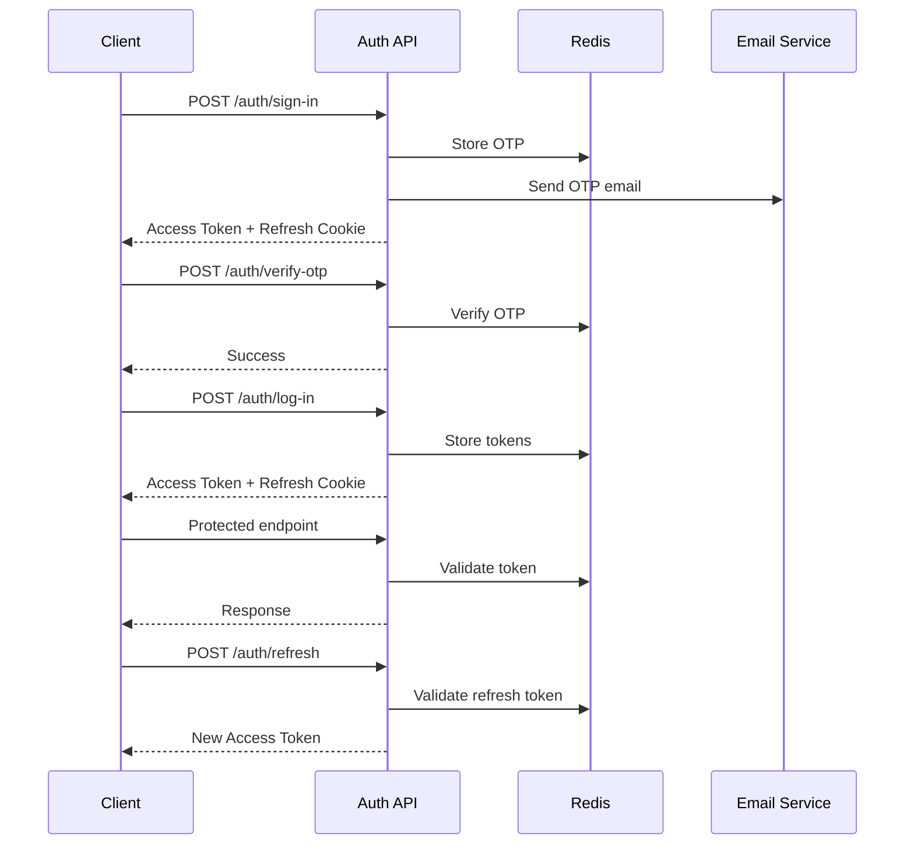

# Authentication API Documentation

This directory contains comprehensive documentation and testing resources for the Authentication API system.

## 📁 Files Overview

### 📄 Documentation Files

- **`authentication-api.md`** - Complete API documentation with all endpoints, request/response formats, error codes, and authentication flows
- **`README.md`** - This file, providing overview and setup instructions

### 🧪 Testing Resources

- **`auth-api-postman-collection.json`** - Complete Postman collection with all authentication endpoints
- **`auth-api-environment.json`** - Postman environment variables for testing

## 🚀 Quick Start

### 1. Import Postman Collection

1. Open Postman
2. Click "Import" button
3. Select `auth-api-postman-collection.json`
4. Import `auth-api-environment.json` as environment
5. Select the "Authentication API Environment" in Postman

### 2. Configure Environment

Update the following variables in your Postman environment:

```json
{
  "baseUrl": "http://localhost:3000",  // Your API base URL
  "userEmail": "your-test@example.com",
  "adminEmail": "admin@example.com",
  "inviteCode": "VALID_INVITE_CODE"
}
```

### 3. Test Authentication Flow

1. **User Registration**: Run "User Sign-in (Registration)" request
2. **OTP Verification**: Check email for OTP, then run "Verify OTP"
3. **Login**: Run "User Login" request
4. **Protected Endpoints**: Use any protected endpoint with auto-set token

## 📋 API Endpoints Summary

### Public Endpoints
- `POST /auth/sign-in` - User registration
- `POST /auth/seller-sign-in` - Seller registration
- `POST /auth/log-in` - User login
- `POST /auth/refresh` - Token refresh
- `POST /auth/log-out` - Logout

### Protected Endpoints (Require Authentication)
- `POST /auth/verify-otp` - Verify phone OTP
- `POST /auth/verify-reset-otp` - Verify password reset OTP
- `POST /auth/reset-password` - Reset password

### Admin Endpoints
- `POST /admin/auth/login` - Admin login
- `POST /admin/auth/register` - Employee registration

## 🔐 Authentication Methods

The API supports two authentication methods:

### 1. Bearer Token (Recommended)
```http
Authorization: Bearer <access_token>
```

### 2. Cookie Authentication
```http
Cookie: accessToken=<access_token>
```

## 🧪 Testing Scenarios

The Postman collection includes comprehensive test scenarios:

### ✅ Success Cases
- User registration and login
- Token refresh
- OTP verification
- Password reset
- Admin authentication
- Employee registration

### ❌ Error Cases
- Invalid credentials
- Duplicate registration
- Invalid OTP
- Missing tokens
- Invalid invite codes
- Validation errors

## 🔧 Environment Variables

### Required Variables
- `baseUrl` - API base URL
- `accessToken` - Auto-populated from responses
- `userEmail` - Test user email
- `adminEmail` - Admin user email

### Optional Variables
- `inviteCode` - For employee registration testing
- `testOtp` - Default OTP for testing
- `uniquePhone` - Auto-generated unique phone
- `uniqueEmail` - Auto-generated unique email

## 📊 Error Codes Reference

| Code | Message | HTTP Status |
|------|---------|-------------|
| 2002 | Account already exists | 400 |
| 4001 | OTP expired or not found | 400 |
| 4002 | Invalid OTP | 400 |
| 4003 | Invalid credentials | 400 |
| 4005 | Failed to verify OTP | 400 |
| 4006 | Expired access token | 403 |
| 4009 | Invalid token | 400 |
| 4010 | Refresh token not in redis | 400 |
| 4013 | Access token not exist | 403 |
| 70000 | Validation error | 400 |

## 🔄 Authentication Flow



## 🛠️ Development Setup

### Prerequisites
- Node.js and npm/yarn
- Redis server
- MongoDB
- Email service (SMTP)

### Environment Variables
```env
JWT_ACCESS_SECRET=your_access_secret
JWT_REFRESH_SECRET=your_refresh_secret
JWT_EXPIRED_ACCESS=15m
JWT_EXPIRED_REFRESH=7d
TTL_REFRESH_TOKEN=604800
MAIL_HOST=smtp.example.com
MAIL_PORT=587
MAIL_USER=your_email@example.com
MAIL_PASSWORD=your_password
```

## 📝 Notes

### Token Storage
- Access tokens are stored in Redis for validation
- Refresh tokens are stored in HTTP-only cookies
- Tokens are automatically rotated on refresh

### Security Features
- Password hashing with bcrypt
- JWT token expiration
- Token rotation
- HTTP-only cookies for refresh tokens
- OTP expiration
- Maximum token count per user

### Rate Limiting
Currently not implemented. Consider adding rate limiting for:
- Login attempts
- OTP requests
- Password reset requests

## 🐛 Troubleshooting

### Common Issues

1. **"Access token not exist" error**
   - Ensure token is included in Authorization header
   - Check if token has expired
   - Verify token format: `Bearer <token>`

2. **"Refresh token not in redis" error**
   - Check if refresh token cookie is being sent
   - Verify Redis connection
   - Check token expiration

3. **OTP verification fails**
   - Verify OTP hasn't expired
   - Check email delivery
   - Ensure correct phone number format

4. **Employee registration fails**
   - Verify invite code is valid and active
   - Check if email already exists
   - Ensure all required fields are provided

## 📞 Support

For issues or questions:
1. Check the error codes reference
2. Review the authentication flow
3. Test with the provided Postman collection
4. Check server logs for detailed error messages

## 🔄 Updates

This documentation is maintained alongside the API. When making changes to the authentication system:

1. Update `authentication-api.md` with new endpoints or changes
2. Add new requests to the Postman collection
3. Update environment variables if needed
4. Test all scenarios after changes
