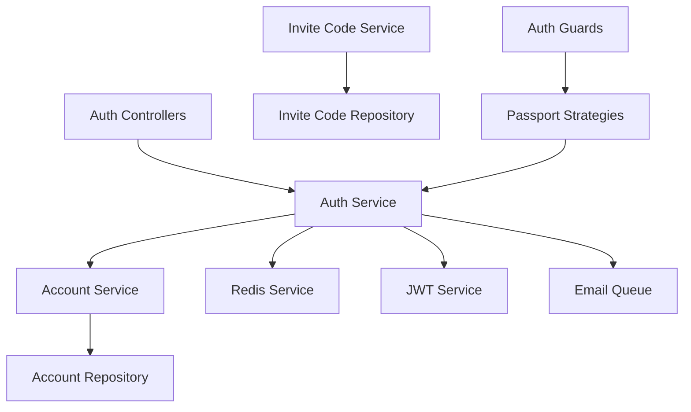
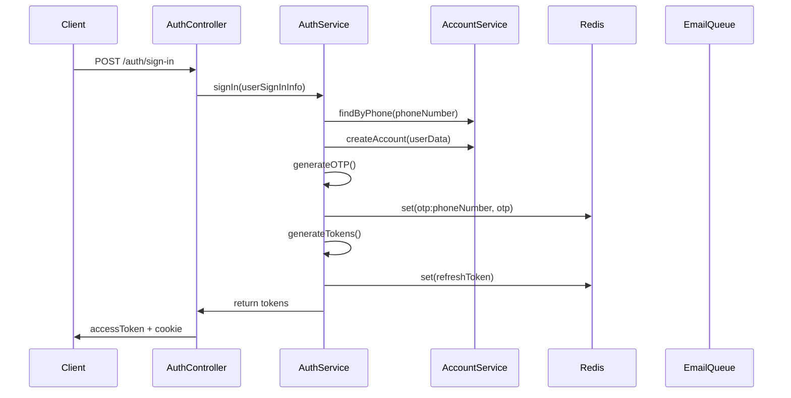
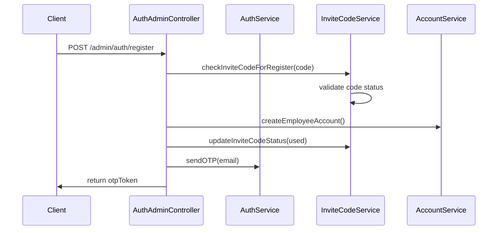

# Authentication System Redesign Specification

## Table of Contents
1. [Current System Analysis](#1-current-system-analysis)
2. [Redesigned Authentication Specification](#2-redesigned-authentication-specification)
3. [Implementation Guidelines](#3-implementation-guidelines)
4. [Security Framework](#4-security-framework)
5. [Technical Specifications](#5-technical-specifications)

---

## 1. Current System Analysis

### 1.1 Architecture Overview

#### Current Module Structure
```
server/src/
├── modules/
│   ├── auth/                    # Core authentication module
│   │   ├── api/controllers/     # Auth controllers (3 separate classes)
│   │   ├── api/dto/            # Request/response DTOs
│   │   └── services/           # Auth business logic
│   ├── account/                # Account management module
│   │   ├── account/            # Base account functionality
│   │   ├── employee/           # Employee-specific logic
│   │   ├── operator/           # Operator-specific logic
│   │   └── user/              # User-specific logic
│   └── invite-code/           # Invite code management
├── package/auth/              # Authentication utilities
│   ├── guards/                # Route protection guards
│   ├── passport/              # Passport strategies
│   ├── decorators/            # Auth decorators
│   └── types/                 # Type definitions
└── common/auth/               # Shared auth constants
```

#### Component Relationships


### 1.2 Endpoint Inventory

#### Current Authentication Endpoints

| Method | Endpoint | Controller | Purpose | Auth Required |
|--------|----------|------------|---------|---------------|
| POST | `/auth/sign-in` | AuthController | User registration | None |
| POST | `/auth/seller-sign-in` | AuthController | Seller registration | None |
| POST | `/auth/log-in` | AuthController | User login | None |
| POST | `/auth/verify-otp` | AuthControllerWithToken | OTP verification | JWT Token |
| POST | `/auth/verify-reset-otp` | AuthControllerWithToken | Reset OTP verification | JWT Token |
| POST | `/auth/reset-password` | AuthControllerWithToken | Password reset | JWT Token |
| POST | `/auth/refresh` | RefreshController | Token refresh | Refresh Cookie |
| POST | `/auth/log-out` | RefreshController | User logout | Refresh Cookie |

#### Admin Authentication Endpoints

| Method | Endpoint | Purpose | Auth Required |
|--------|----------|---------|---------------|
| POST | `/admin/auth/login` | Admin login | None |
| POST | `/admin/auth/register` | Employee registration | OTP Token |
| POST | `/admin/auth/send-otp` | Send admin OTP | None |

### 1.3 Data Flow Analysis

#### Current User Registration Flow


#### Current Employee Registration Flow


### 1.4 Security Assessment

#### Current Security Measures
1. **JWT Implementation**:
   - Access tokens with user payload
   - Refresh tokens with rotation
   - Redis-based token storage
   - HTTP-only cookies for refresh tokens

2. **Password Security**:
   - bcrypt hashing with salt rounds
   - Password validation in DTOs

3. **OTP System**:
   - 6-digit numeric OTP generation
   - Redis storage with TTL
   - Email delivery via queue system

4. **Session Management**:
   - Redis-based refresh token storage
   - Token count limiting per user
   - Automatic cleanup of expired tokens

#### Identified Security Vulnerabilities

1. **Inconsistent Token Handling**:
   - Some endpoints return tokens in response body
   - Mixed cookie and header-based authentication
   - Inconsistent token validation across endpoints

2. **OTP Security Issues**:
   - No rate limiting on OTP requests
   - Long TTL values (30000000ms = ~8 hours)
   - Inconsistent OTP storage keys

3. **Session Management Problems**:
   - Inconsistent refresh token key patterns
   - No proper session invalidation
   - Missing CSRF protection

4. **Input Validation Gaps**:
   - Incomplete validation in some DTOs
   - No rate limiting on authentication endpoints
   - Missing email format validation

5. **Error Information Disclosure**:
   - Detailed error messages revealing system internals
   - No standardized error response format

### 1.5 Performance Analysis

#### Current Redis Usage Patterns
```typescript
// Current Redis Key Patterns
"otp:{phoneNumber}" // OTP storage
"otp:{email}" // Email OTP storage  
"refreshToken:{userId}:{jti}" // Refresh tokens
"reset_token:{email}" // Password reset tokens
"reset:{email}" // Reset OTP storage
```

#### Performance Issues Identified
1. **Inefficient Key Patterns**: Inconsistent naming conventions
2. **Long TTL Values**: Excessive memory usage
3. **Missing Indexing**: No proper database indexing strategy
4. **Redundant Queries**: Multiple database calls in single operations

---

## 2. Redesigned Authentication Specification

### 2.1 New Architecture Design

#### Proposed Module Structure
```
server/src/
├── modules/
│   ├── auth/
│   │   ├── controllers/
│   │   │   ├── auth.controller.ts           # Public auth endpoints
│   │   │   ├── auth-admin.controller.ts     # Admin auth endpoints
│   │   │   └── auth-session.controller.ts   # Session management
│   │   ├── services/
│   │   │   ├── auth.service.ts              # Core auth logic
│   │   │   ├── registration.service.ts      # Multi-step registration
│   │   │   ├── session.service.ts           # Session management
│   │   │   └── otp.service.ts              # OTP operations
│   │   ├── dto/
│   │   │   ├── registration/               # Registration flow DTOs
│   │   │   ├── authentication/             # Login/logout DTOs
│   │   │   └── session/                    # Session management DTOs
│   │   └── types/
│   │       ├── session.types.ts            # Session interfaces
│   │       └── auth.types.ts               # Auth interfaces
│   └── invite-code/                        # Enhanced invite code module
└── package/auth/                           # Enhanced auth utilities
    ├── guards/
    │   ├── session-token.guard.ts          # Session validation
    │   ├── otp-token.guard.ts             # OTP validation
    │   └── registration-token.guard.ts     # Registration validation
    ├── strategies/
    │   ├── session.strategy.ts             # Session token strategy
    │   └── registration.strategy.ts        # Registration token strategy
    └── validators/
        ├── invite-code.validator.ts        # Invite code validation
        └── registration.validator.ts       # Registration validation
```

### 2.2 API Endpoint Specifications

#### 2.2.1 Step 1: Invite Code Validation

**Endpoint**: `POST /auth/validate-invite-code`

**Request Schema**:
```typescript
{
  "inviteCode": {
    "type": "string",
    "pattern": "^\\$INV-\\d{4}-[A-Z0-9]{6}$",
    "description": "Invite code in format $INV-YYYY-XXXXXX"
  }
}
```

**Response Schema**:
```typescript
{
  "data": {
    "sessionToken": {
      "type": "string",
      "description": "Temporary session token (15-minute TTL)"
    },
    "position": {
      "type": "object",
      "properties": {
        "id": { "type": "string" },
        "name": { "type": "string" },
        "department": {
          "type": "object",
          "properties": {
            "id": { "type": "string" },
            "name": { "type": "string" }
          }
        }
      }
    },
    "privileges": {
      "type": "array",
      "items": {
        "type": "object",
        "properties": {
          "id": { "type": "string" },
          "name": { "type": "string" }
        }
      }
    }
  },
  "message": "Invite code validated successfully"
}
```

**Error Responses**:
```typescript
// Invalid Code Format
{
  "error": {
    "code": 13000,
    "message": "Invalid invite code format",
    "type": "VALIDATION_ERROR"
  }
}

// Code Not Found
{
  "error": {
    "code": 13000,
    "message": "Invite code not found",
    "type": "INVITE_CODE_NOT_FOUND"
  }
}

// Code Already Used
{
  "error": {
    "code": 13001,
    "message": "Invite code has already been used",
    "type": "INVITE_CODE_USED"
  }
}

// Rate Limit Exceeded
{
  "error": {
    "code": 4290,
    "message": "Too many validation attempts. Please try again later.",
    "type": "RATE_LIMIT_EXCEEDED",
    "details": {
      "retryAfter": 900
    }
  }
}
```

#### 2.2.2 Step 2: Email Registration

**Endpoint**: `POST /auth/register-email`

**Authentication**: Bearer token (session token from Step 1)

**Request Schema**:
```typescript
{
  "email": {
    "type": "string",
    "format": "email",
    "maxLength": 254,
    "description": "Valid email address"
  },
  "firstName": {
    "type": "string",
    "minLength": 1,
    "maxLength": 50,
    "pattern": "^[a-zA-Z\\s'-]+$"
  },
  "lastName": {
    "type": "string",
    "minLength": 1,
    "maxLength": 50,
    "pattern": "^[a-zA-Z\\s'-]+$"
  }
}
```

**Response Schema**:
```typescript
{
  "data": {
    "otpToken": {
      "type": "string",
      "description": "OTP verification token"
    }
  },
  "message": "OTP sent to email address"
}
```

**Error Responses**:
```typescript
// Invalid Session Token
{
  "error": {
    "code": 4013,
    "message": "Invalid or expired session token",
    "type": "INVALID_SESSION_TOKEN"
  }
}

// Duplicate Email
{
  "error": {
    "code": 5011,
    "message": "Email address already registered",
    "type": "DUPLICATED_EMAIL"
  }
}

// Invalid Email Format
{
  "error": {
    "code": 70000,
    "message": "Invalid email format",
    "type": "VALIDATION_ERROR"
  }
}
```

#### 2.2.3 Step 3: OTP Verification

**Endpoint**: `POST /auth/verify-registration-otp`

**Authentication**: Bearer token (OTP token from Step 2)

**Request Schema**:
```typescript
{
  "otp": {
    "type": "string",
    "pattern": "^\\d{6}$",
    "description": "6-digit OTP code"
  }
}
```

**Response Schema**:
```typescript
{
  "data": {
    "registrationToken": {
      "type": "string",
      "description": "Registration completion token"
    }
  },
  "message": "OTP verified successfully"
}
```

**Error Responses**:
```typescript
// Invalid OTP
{
  "error": {
    "code": 4002,
    "message": "Invalid OTP code",
    "type": "INVALID_OTP"
  }
}

// Expired OTP
{
  "error": {
    "code": 4001,
    "message": "OTP has expired",
    "type": "OTP_EXPIRED"
  }
}

// Too Many Attempts
{
  "error": {
    "code": 4291,
    "message": "Too many OTP verification attempts",
    "type": "OTP_ATTEMPTS_EXCEEDED",
    "details": {
      "retryAfter": 300
    }
  }
}
```

#### 2.2.4 Step 4: Registration Completion

**Endpoint**: `POST /auth/complete-registration`

**Authentication**: Bearer token (registration token from Step 3)

**Request Schema**:
```typescript
{
  "password": {
    "type": "string",
    "minLength": 8,
    "maxLength": 128,
    "pattern": "^(?=.*[a-z])(?=.*[A-Z])(?=.*\\d)(?=.*[@$!%*?&])[A-Za-z\\d@$!%*?&]",
    "description": "Password with uppercase, lowercase, number, and special character"
  },
  "phoneNumber": {
    "type": "string",
    "pattern": "^\\+?[1-9]\\d{1,14}$",
    "description": "Optional phone number in E.164 format"
  }
}
```

**Response Schema**:
```typescript
{
  "data": {
    "accessToken": {
      "type": "string",
      "description": "JWT access token"
    },
    "user": {
      "type": "object",
      "properties": {
        "id": { "type": "string" },
        "email": { "type": "string" },
        "firstName": { "type": "string" },
        "lastName": { "type": "string" },
        "accountRole": { "type": "string", "enum": ["EMPLOYEE"] },
        "isVerified": { "type": "boolean", "const": true },
        "employee": {
          "type": "object",
          "properties": {
            "position": { "type": "object" },
            "department": { "type": "object" },
            "privileges": { "type": "array" },
            "hireDate": { "type": "string", "format": "date-time" }
          }
        }
      }
    }
  },
  "message": "Registration completed successfully"
}
```

#### 2.2.5 Enhanced Core Authentication Endpoints

**Login Endpoint**: `POST /auth/login`
```typescript
// Request
{
  "email": "string",
  "password": "string"
}

// Response
{
  "data": {
    "accessToken": "string",
    "user": {
      "id": "string",
      "email": "string",
      "firstName": "string",
      "lastName": "string",
      "accountRole": "string",
      "isVerified": boolean
    }
  }
}
```

**Password Reset Flow**:
```typescript
// Step 1: Request Reset
POST /auth/request-password-reset
{
  "email": "string"
}

// Step 2: Verify Reset OTP
POST /auth/verify-reset-otp
{
  "email": "string",
  "otp": "string"
}

// Step 3: Reset Password
POST /auth/reset-password
Headers: { "Authorization": "Bearer <reset_token>" }
{
  "newPassword": "string"
}
```

### 2.3 Database Schema Changes

#### 2.3.1 Enhanced Account Schema
```typescript
// Enhanced Account Document
{
  _id: ObjectId,
  email: string, // unique, required, indexed
  phoneNumber?: string, // unique, sparse index
  firstName: string, // required, min 1, max 50
  lastName: string, // required, min 1, max 50
  password: string, // bcrypt hashed, required
  accountRole: AccountRole, // enum, required
  isActive: boolean, // default true, indexed
  isVerified: boolean, // default false, indexed

  // Employee-specific data (when accountRole = EMPLOYEE)
  employee?: {
    inviteCode: string, // reference to used invite code
    position: ObjectId, // reference to Position
    department: ObjectId, // reference to Department
    privileges: ObjectId[], // array of Privilege references
    hireDate: Date, // required for employees
    status: EmployeeStatus, // Active, Inactive, Terminated
    baseSalary?: number,
    employmentType?: string
  },

  // Audit fields
  createdAt: Date,
  updatedAt: Date,
  lastLoginAt?: Date,

  // Security fields
  passwordChangedAt?: Date,
  failedLoginAttempts: number, // default 0
  lockedUntil?: Date
}

// Indexes
db.accounts.createIndex({ email: 1 }, { unique: true })
db.accounts.createIndex({ phoneNumber: 1 }, { unique: true, sparse: true })
db.accounts.createIndex({ accountRole: 1, isActive: 1 })
db.accounts.createIndex({ "employee.department": 1 })
db.accounts.createIndex({ "employee.position": 1 })
db.accounts.createIndex({ createdAt: 1 })
```

#### 2.3.2 Enhanced Invite Code Schema
```typescript
// Enhanced InviteCode Document
{
  _id: ObjectId,
  code: string, // unique, required, indexed
  position: ObjectId, // required, reference to Position
  privileges: ObjectId[], // array of Privilege references

  // Status management
  status: InviteCodeStatus, // Active, Used, Expired, Revoked

  // Usage tracking
  usedBy?: ObjectId, // reference to Account when used
  usedAt?: Date, // timestamp when used

  // Expiration management
  expiresAt?: Date, // optional expiration date

  // Audit fields
  createdBy: ObjectId, // admin who created the code
  createdAt: Date,
  updatedAt: Date,

  // Metadata
  notes?: string, // optional admin notes
  maxUses: number // default 1, for future multi-use codes
}

// Indexes
db.invitecodes.createIndex({ code: 1 }, { unique: true })
db.invitecodes.createIndex({ status: 1, expiresAt: 1 })
db.invitecodes.createIndex({ position: 1 })
db.invitecodes.createIndex({ createdBy: 1, createdAt: 1 })
db.invitecodes.createIndex({ usedBy: 1 }, { sparse: true })
```

### 2.4 Error Handling Framework

#### 2.4.1 Enhanced Error Codes
```typescript
export enum AuthErrorCode {
  // Session Management (4200-4299)
  INVALID_SESSION_TOKEN = 4200,
  EXPIRED_SESSION_TOKEN = 4201,
  SESSION_NOT_FOUND = 4202,

  // Registration Flow (4300-4399)
  REGISTRATION_TOKEN_INVALID = 4300,
  REGISTRATION_TOKEN_EXPIRED = 4301,
  REGISTRATION_STEP_INVALID = 4302,
  REGISTRATION_DATA_INCOMPLETE = 4303,

  // Rate Limiting (4400-4499)
  RATE_LIMIT_EXCEEDED = 4400,
  OTP_ATTEMPTS_EXCEEDED = 4401,
  LOGIN_ATTEMPTS_EXCEEDED = 4402,
  INVITE_CODE_ATTEMPTS_EXCEEDED = 4403,

  // Enhanced Invite Code Errors (13000-13099)
  INVITE_CODE_NOT_FOUND = 13000,
  INVITE_CODE_USED = 13001,
  INVITE_CODE_EXPIRED = 13002,
  INVITE_CODE_REVOKED = 13003,
  INVITE_CODE_INVALID_FORMAT = 13004,

  // Enhanced OTP Errors (4000-4099)
  OTP_EXPIRED = 4001,
  INVALID_OTP = 4002,
  OTP_NOT_FOUND = 4003,
  OTP_ALREADY_VERIFIED = 4004,
  OTP_GENERATION_FAILED = 4005
}
```

#### 2.4.2 Standardized Error Response Format
```typescript
interface ErrorResponse {
  error: {
    code: number;
    message: string;
    type: string;
    timestamp: string;
    requestId: string;
    details?: {
      field?: string;
      retryAfter?: number;
      maxAttempts?: number;
      remainingAttempts?: number;
    };
  };
}
```

---

## 3. Implementation Guidelines

### 3.1 Migration Strategy

#### Phase 1: Foundation Setup (Week 1-2)
1. **Create New Service Classes**:
   - `RegistrationService` for multi-step registration
   - `SessionService` for session management
   - `OtpService` for OTP operations

2. **Implement New Guards and Strategies**:
   - `SessionTokenGuard` for session validation
   - `RegistrationTokenGuard` for registration flow
   - Enhanced rate limiting middleware

3. **Database Schema Updates**:
   - Add new indexes to existing collections
   - Create migration scripts for schema changes
   - Implement backward compatibility layers

#### Phase 2: Registration Flow Implementation (Week 3-4)
1. **Implement Step-by-Step Registration**:
   - Create new registration endpoints
   - Implement session management with Redis
   - Add comprehensive validation and error handling

2. **Testing and Validation**:
   - Unit tests for all new services
   - Integration tests for complete registration flow
   - Security testing for rate limiting and validation

#### Phase 3: Enhanced Authentication (Week 5-6)
1. **Upgrade Existing Endpoints**:
   - Enhance login endpoint with new security features
   - Implement improved password reset flow
   - Add session management improvements

2. **Security Enhancements**:
   - Implement CSRF protection
   - Add comprehensive rate limiting
   - Enhance token security

#### Phase 4: Migration and Cleanup (Week 7-8)
1. **Gradual Migration**:
   - Deploy new endpoints alongside existing ones
   - Migrate frontend to use new endpoints
   - Monitor performance and security metrics

2. **Cleanup and Optimization**:
   - Remove deprecated endpoints
   - Optimize Redis usage patterns
   - Performance tuning and monitoring setup

### 3.2 Integration Points

#### 3.2.1 Auth ↔ Account System Integration
```typescript
interface AuthAccountIntegration {
  // Account creation with transaction support
  createEmployeeAccount(data: EmployeeAccountData, session?: ClientSession): Promise<Account>;

  // Account validation and retrieval
  validateAccountCredentials(email: string, password: string): Promise<Account>;
  findAccountByEmail(email: string): Promise<Account | null>;

  // Account status management
  updateAccountVerificationStatus(accountId: string, verified: boolean): Promise<void>;
  updateLastLoginTime(accountId: string): Promise<void>;

  // Security operations
  incrementFailedLoginAttempts(accountId: string): Promise<void>;
  resetFailedLoginAttempts(accountId: string): Promise<void>;
  lockAccount(accountId: string, lockDuration: number): Promise<void>;
}
```

#### 3.2.2 Auth ↔ Invite Code System Integration
```typescript
interface AuthInviteCodeIntegration {
  // Invite code validation
  validateInviteCode(code: string): Promise<InviteCodeValidationResult>;

  // Invite code usage tracking
  markInviteCodeAsUsed(code: string, accountId: string): Promise<void>;

  // Position and privilege retrieval
  getInviteCodeDetails(code: string): Promise<InviteCodeDetails>;

  // Status management
  updateInviteCodeStatus(code: string, status: InviteCodeStatus): Promise<void>;
}

interface InviteCodeValidationResult {
  valid: boolean;
  code?: InviteCode;
  position?: Position;
  privileges?: Privilege[];
  error?: string;
}
```

#### 3.2.3 Auth ↔ Email System Integration
```typescript
interface AuthEmailIntegration {
  // OTP delivery
  sendRegistrationOTP(email: string, otp: string, userData: UserData): Promise<void>;
  sendPasswordResetOTP(email: string, otp: string): Promise<void>;

  // Welcome and notification emails
  sendWelcomeEmail(account: Account): Promise<void>;
  sendPasswordChangeNotification(account: Account): Promise<void>;

  // Email template management
  getEmailTemplate(type: EmailType, language?: string): Promise<EmailTemplate>;
}
```

### 3.3 Testing Requirements

#### 3.3.1 Unit Test Specifications
```typescript
// Registration Service Tests
describe('RegistrationService', () => {
  describe('validateInviteCode', () => {
    it('should validate active invite code successfully');
    it('should reject used invite code');
    it('should reject expired invite code');
    it('should reject invalid code format');
    it('should handle database errors gracefully');
  });

  describe('registerEmail', () => {
    it('should register email with valid session token');
    it('should reject duplicate email addresses');
    it('should validate email format');
    it('should generate and store OTP');
    it('should queue email for delivery');
  });

  describe('verifyOTP', () => {
    it('should verify valid OTP');
    it('should reject invalid OTP');
    it('should reject expired OTP');
    it('should implement rate limiting');
  });

  describe('completeRegistration', () => {
    it('should create employee account successfully');
    it('should link to invite code data');
    it('should mark invite code as used');
    it('should generate authentication tokens');
    it('should handle transaction failures');
  });
});
```

#### 3.3.2 Integration Test Specifications
```typescript
// Complete Registration Flow Tests
describe('Registration Flow Integration', () => {
  it('should complete full registration flow successfully', async () => {
    // Step 1: Validate invite code
    const step1Response = await request(app)
      .post('/auth/validate-invite-code')
      .send({ inviteCode: 'valid-code' });

    // Step 2: Register email
    const step2Response = await request(app)
      .post('/auth/register-email')
      .set('Authorization', `Bearer ${step1Response.body.data.sessionToken}`)
      .send({ email: 'test@example.com', firstName: 'John', lastName: 'Doe' });

    // Step 3: Verify OTP
    const step3Response = await request(app)
      .post('/auth/verify-registration-otp')
      .set('Authorization', `Bearer ${step2Response.body.data.otpToken}`)
      .send({ otp: '123456' });

    // Step 4: Complete registration
    const step4Response = await request(app)
      .post('/auth/complete-registration')
      .set('Authorization', `Bearer ${step3Response.body.data.registrationToken}`)
      .send({ password: 'SecurePass123!' });

    expect(step4Response.status).toBe(201);
    expect(step4Response.body.data.accessToken).toBeDefined();
  });
});
```

#### 3.3.3 Security Test Specifications
```typescript
// Security Tests
describe('Authentication Security', () => {
  describe('Rate Limiting', () => {
    it('should limit invite code validation attempts');
    it('should limit OTP verification attempts');
    it('should limit login attempts');
    it('should implement progressive delays');
  });

  describe('Token Security', () => {
    it('should validate JWT signatures');
    it('should reject expired tokens');
    it('should implement proper token rotation');
    it('should secure cookie configuration');
  });

  describe('Input Validation', () => {
    it('should sanitize all input data');
    it('should validate email formats');
    it('should enforce password complexity');
    it('should prevent injection attacks');
  });
});
```

### 3.4 Monitoring and Logging

#### 3.4.1 Authentication Metrics
```typescript
interface AuthMetrics {
  // Registration metrics
  registrationAttempts: Counter;
  registrationCompletions: Counter;
  registrationStepDropoffs: Counter;

  // Authentication metrics
  loginAttempts: Counter;
  loginSuccesses: Counter;
  loginFailures: Counter;

  // Security metrics
  rateLimitHits: Counter;
  suspiciousActivity: Counter;
  tokenValidationFailures: Counter;

  // Performance metrics
  authenticationLatency: Histogram;
  redisOperationLatency: Histogram;
  databaseOperationLatency: Histogram;
}
```

#### 3.4.2 Security Event Logging
```typescript
interface SecurityEvent {
  timestamp: Date;
  eventType: SecurityEventType;
  userId?: string;
  ipAddress: string;
  userAgent: string;
  details: Record<string, any>;
  severity: 'LOW' | 'MEDIUM' | 'HIGH' | 'CRITICAL';
}

enum SecurityEventType {
  FAILED_LOGIN = 'failed_login',
  ACCOUNT_LOCKED = 'account_locked',
  SUSPICIOUS_ACTIVITY = 'suspicious_activity',
  RATE_LIMIT_EXCEEDED = 'rate_limit_exceeded',
  INVALID_TOKEN = 'invalid_token',
  PASSWORD_RESET_REQUESTED = 'password_reset_requested'
}
```

---

## 4. Security Framework

### 4.1 Token Management

#### 4.1.1 JWT Configuration
```typescript
interface JWTConfig {
  // Access Token Configuration
  accessToken: {
    secret: string; // RS256 private key
    algorithm: 'RS256';
    expiresIn: '15m';
    issuer: string;
    audience: string;
  };

  // Refresh Token Configuration
  refreshToken: {
    secret: string; // Separate secret for refresh tokens
    algorithm: 'HS256';
    expiresIn: '7d';
    issuer: string;
    audience: string;
  };

  // Session Token Configuration (for registration flow)
  sessionToken: {
    secret: string;
    algorithm: 'HS256';
    expiresIn: '15m';
    issuer: string;
  };

  // OTP Token Configuration
  otpToken: {
    secret: string;
    algorithm: 'HS256';
    expiresIn: '10m';
    issuer: string;
  };
}
```

#### 4.1.2 Token Payload Structures
```typescript
// Access Token Payload
interface AccessTokenPayload {
  sub: string; // User ID
  email: string;
  role: AccountRole;
  isVerified: boolean;
  iat: number;
  exp: number;
  iss: string;
  aud: string;
}

// Refresh Token Payload
interface RefreshTokenPayload {
  sub: string; // User ID
  jti: string; // JWT ID for token rotation
  iat: number;
  exp: number;
  iss: string;
  aud: string;
}

// Session Token Payload (Registration Flow)
interface SessionTokenPayload {
  sessionId: string;
  inviteCode: string;
  step: 'invite_validated' | 'email_registered' | 'otp_verified';
  iat: number;
  exp: number;
  iss: string;
}

// OTP Token Payload
interface OTPTokenPayload {
  sessionId: string;
  email: string;
  type: 'registration' | 'password_reset';
  iat: number;
  exp: number;
  iss: string;
}
```

#### 4.1.3 Refresh Token Rotation Strategy
```typescript
interface RefreshTokenRotation {
  // Generate new token pair
  rotateTokens(refreshToken: string): Promise<TokenPair>;

  // Invalidate token family on suspicious activity
  invalidateTokenFamily(userId: string, jti: string): Promise<void>;

  // Clean up expired tokens
  cleanupExpiredTokens(): Promise<void>;

  // Token validation with automatic rotation
  validateAndRotate(refreshToken: string): Promise<TokenValidationResult>;
}

interface TokenPair {
  accessToken: string;
  refreshToken: string;
  expiresIn: number;
}
```

### 4.2 Session Security

#### 4.2.1 Redis Session Management
```typescript
interface SessionManager {
  // Session creation and management
  createSession(data: SessionData): Promise<string>;
  getSession(sessionId: string): Promise<SessionData | null>;
  updateSession(sessionId: string, data: Partial<SessionData>): Promise<void>;
  deleteSession(sessionId: string): Promise<void>;

  // Session validation
  validateSession(sessionId: string, requiredStep?: RegistrationStep): Promise<boolean>;

  // Cleanup operations
  cleanupExpiredSessions(): Promise<void>;
  deleteUserSessions(userId: string): Promise<void>;
}

interface SessionData {
  sessionId: string;
  inviteCode: string;
  position: Position;
  privileges: Privilege[];
  email?: string;
  firstName?: string;
  lastName?: string;
  step: RegistrationStep;
  createdAt: number;
  expiresAt: number;
  ipAddress: string;
  userAgent: string;
}
```

#### 4.2.2 Redis Key Schema Design
```typescript
// Redis Key Patterns
const RedisKeys = {
  // Session Management
  SESSION: (sessionId: string) => `auth:session:${sessionId}`,
  USER_SESSIONS: (userId: string) => `auth:user_sessions:${userId}`,

  // OTP Management
  OTP: (email: string, type: string) => `auth:otp:${type}:${email}`,
  OTP_ATTEMPTS: (identifier: string) => `auth:otp_attempts:${identifier}`,

  // Token Management
  REFRESH_TOKEN: (userId: string, jti: string) => `auth:refresh:${userId}:${jti}`,
  TOKEN_BLACKLIST: (jti: string) => `auth:blacklist:${jti}`,

  // Rate Limiting
  RATE_LIMIT: (type: string, identifier: string) => `auth:rate_limit:${type}:${identifier}`,

  // Security
  FAILED_ATTEMPTS: (identifier: string) => `auth:failed_attempts:${identifier}`,
  ACCOUNT_LOCK: (userId: string) => `auth:account_lock:${userId}`
} as const;

// TTL Constants
const RedisTTL = {
  SESSION: 15 * 60, // 15 minutes
  OTP: 10 * 60, // 10 minutes
  REFRESH_TOKEN: 7 * 24 * 60 * 60, // 7 days
  RATE_LIMIT: 15 * 60, // 15 minutes
  FAILED_ATTEMPTS: 60 * 60, // 1 hour
  ACCOUNT_LOCK: 24 * 60 * 60 // 24 hours
} as const;
```

### 4.3 Input Validation

#### 4.3.1 Zod Schema Definitions
```typescript
// Invite Code Validation
export const InviteCodeSchema = z.object({
  inviteCode: z.string()
    .regex(/^\$INV-\d{4}-[A-Z0-9]{6}$/, 'Invalid invite code format')
    .describe('Invite code in format $INV-YYYY-XXXXXX')
});

// Email Registration Schema
export const EmailRegistrationSchema = z.object({
  email: z.string()
    .email('Invalid email format')
    .max(254, 'Email too long')
    .toLowerCase()
    .describe('Valid email address'),
  firstName: z.string()
    .min(1, 'First name required')
    .max(50, 'First name too long')
    .regex(/^[a-zA-Z\s'-]+$/, 'Invalid characters in first name')
    .trim(),
  lastName: z.string()
    .min(1, 'Last name required')
    .max(50, 'Last name too long')
    .regex(/^[a-zA-Z\s'-]+$/, 'Invalid characters in last name')
    .trim()
});

// OTP Verification Schema
export const OTPVerificationSchema = z.object({
  otp: z.string()
    .regex(/^\d{6}$/, 'OTP must be 6 digits')
    .describe('6-digit OTP code')
});

// Password Schema
export const PasswordSchema = z.string()
  .min(8, 'Password must be at least 8 characters')
  .max(128, 'Password too long')
  .regex(
    /^(?=.*[a-z])(?=.*[A-Z])(?=.*\d)(?=.*[@$!%*?&])[A-Za-z\d@$!%*?&]/,
    'Password must contain uppercase, lowercase, number, and special character'
  );

// Registration Completion Schema
export const RegistrationCompletionSchema = z.object({
  password: PasswordSchema,
  phoneNumber: z.string()
    .regex(/^\+?[1-9]\d{1,14}$/, 'Invalid phone number format')
    .optional()
    .describe('Phone number in E.164 format')
});
```

### 4.4 Rate Limiting

#### 4.4.1 Rate Limiting Configuration
```typescript
interface RateLimitConfig {
  // Invite code validation
  inviteCodeValidation: {
    windowMs: 15 * 60 * 1000; // 15 minutes
    max: 5; // 5 attempts per window
    skipSuccessfulRequests: true;
    keyGenerator: (req) => req.ip;
  };

  // OTP operations
  otpGeneration: {
    windowMs: 15 * 60 * 1000; // 15 minutes
    max: 3; // 3 OTP requests per window
    skipSuccessfulRequests: false;
    keyGenerator: (req) => req.body.email || req.ip;
  };

  otpVerification: {
    windowMs: 10 * 60 * 1000; // 10 minutes
    max: 3; // 3 verification attempts per window
    skipSuccessfulRequests: true;
    keyGenerator: (req) => req.user?.sessionId || req.ip;
  };

  // Authentication
  login: {
    windowMs: 15 * 60 * 1000; // 15 minutes
    max: 5; // 5 login attempts per window
    skipSuccessfulRequests: true;
    keyGenerator: (req) => req.body.email || req.ip;
  };

  // Password reset
  passwordReset: {
    windowMs: 60 * 60 * 1000; // 1 hour
    max: 3; // 3 reset requests per hour
    skipSuccessfulRequests: false;
    keyGenerator: (req) => req.body.email || req.ip;
  };
}
```

#### 4.4.2 Progressive Rate Limiting
```typescript
interface ProgressiveRateLimit {
  // Implement exponential backoff for repeated failures
  calculateDelay(attemptCount: number): number;

  // Track and increment failure counts
  recordFailedAttempt(identifier: string, type: string): Promise<number>;

  // Reset failure count on success
  resetFailureCount(identifier: string, type: string): Promise<void>;

  // Check if identifier is currently rate limited
  isRateLimited(identifier: string, type: string): Promise<RateLimitResult>;
}

interface RateLimitResult {
  limited: boolean;
  retryAfter?: number;
  remainingAttempts?: number;
  resetTime?: number;
}
```

### 4.5 CSRF Protection

#### 4.5.1 CSRF Token Implementation
```typescript
interface CSRFProtection {
  // Generate CSRF token for session
  generateCSRFToken(sessionId: string): Promise<string>;

  // Validate CSRF token
  validateCSRFToken(sessionId: string, token: string): Promise<boolean>;

  // Middleware for CSRF protection
  csrfProtectionMiddleware(): MiddlewareFunction;
}

// CSRF Configuration
interface CSRFConfig {
  tokenLength: 32;
  headerName: 'X-CSRF-Token';
  cookieName: 'csrf-token';
  cookieOptions: {
    httpOnly: false; // Client needs to read for AJAX requests
    secure: boolean; // true in production
    sameSite: 'strict';
    maxAge: 15 * 60 * 1000; // 15 minutes
  };
}
```

---

## 5. Technical Specifications

### 5.1 Cookie Configuration

#### 5.1.1 Production Cookie Settings
```typescript
const ProductionCookieConfig = {
  refreshToken: {
    name: 'refreshToken',
    httpOnly: true,
    secure: true,
    sameSite: 'strict' as const,
    maxAge: 7 * 24 * 60 * 60 * 1000, // 7 days
    domain: process.env.COOKIE_DOMAIN,
    path: '/',
    signed: true
  },

  csrfToken: {
    name: 'csrf-token',
    httpOnly: false,
    secure: true,
    sameSite: 'strict' as const,
    maxAge: 15 * 60 * 1000, // 15 minutes
    domain: process.env.COOKIE_DOMAIN,
    path: '/'
  }
} as const;
```

#### 5.1.2 Development Cookie Settings
```typescript
const DevelopmentCookieConfig = {
  refreshToken: {
    name: 'refreshToken',
    httpOnly: true,
    secure: false, // Allow HTTP in development
    sameSite: 'lax' as const,
    maxAge: 7 * 24 * 60 * 60 * 1000,
    path: '/',
    signed: true
  },

  csrfToken: {
    name: 'csrf-token',
    httpOnly: false,
    secure: false,
    sameSite: 'lax' as const,
    maxAge: 15 * 60 * 1000,
    path: '/'
  }
} as const;
```

### 5.2 Redis Schema Design

#### 5.2.1 Key Naming Conventions
```typescript
// Hierarchical key structure: service:type:identifier:subtype
const RedisKeyPatterns = {
  // Authentication service keys
  AUTH_SESSION: 'auth:session:{sessionId}',
  AUTH_OTP: 'auth:otp:{type}:{email}',
  AUTH_REFRESH_TOKEN: 'auth:refresh:{userId}:{jti}',
  AUTH_RATE_LIMIT: 'auth:rate_limit:{type}:{identifier}',

  // Security-related keys
  SECURITY_FAILED_ATTEMPTS: 'security:failed_attempts:{identifier}',
  SECURITY_ACCOUNT_LOCK: 'security:account_lock:{userId}',
  SECURITY_TOKEN_BLACKLIST: 'security:blacklist:{jti}',

  // Session management
  SESSION_USER_MAPPING: 'session:user_mapping:{userId}',
  SESSION_CLEANUP: 'session:cleanup:{timestamp}'
} as const;
```

#### 5.2.2 Data Structures and TTL Strategies
```typescript
// Session Data Structure
interface RedisSessionData {
  sessionId: string;
  userId?: string;
  inviteCode: string;
  positionId: string;
  privilegeIds: string[];
  email?: string;
  firstName?: string;
  lastName?: string;
  step: RegistrationStep;
  metadata: {
    ipAddress: string;
    userAgent: string;
    createdAt: number;
    lastActivity: number;
  };
}

// OTP Data Structure
interface RedisOTPData {
  otp: string;
  email: string;
  type: 'registration' | 'password_reset';
  attempts: number;
  createdAt: number;
  expiresAt: number;
}

// Rate Limit Data Structure
interface RedisRateLimitData {
  count: number;
  resetTime: number;
  firstAttempt: number;
}

// TTL Management Strategy
const TTLStrategy = {
  // Short-lived data (minutes)
  SESSION: 15 * 60, // 15 minutes
  OTP: 10 * 60, // 10 minutes
  CSRF_TOKEN: 15 * 60, // 15 minutes

  // Medium-lived data (hours)
  RATE_LIMIT: 60 * 60, // 1 hour
  FAILED_ATTEMPTS: 60 * 60, // 1 hour

  // Long-lived data (days)
  REFRESH_TOKEN: 7 * 24 * 60 * 60, // 7 days
  ACCOUNT_LOCK: 24 * 60 * 60, // 24 hours

  // Cleanup data (weeks)
  TOKEN_BLACKLIST: 30 * 24 * 60 * 60 // 30 days
} as const;
```

### 5.3 Email Integration

#### 5.3.1 Email Template Management
```typescript
interface EmailTemplateConfig {
  templates: {
    registrationOTP: {
      subject: 'Complete Your Registration - OTP Verification';
      templatePath: 'templates/registration-otp.hbs';
      variables: ['firstName', 'otp', 'companyName', 'expiryMinutes'];
    };

    passwordResetOTP: {
      subject: 'Password Reset Request - OTP Verification';
      templatePath: 'templates/password-reset-otp.hbs';
      variables: ['firstName', 'otp', 'expiryMinutes'];
    };

    welcomeEmail: {
      subject: 'Welcome to the Team!';
      templatePath: 'templates/welcome.hbs';
      variables: ['firstName', 'lastName', 'position', 'department'];
    };

    passwordChanged: {
      subject: 'Password Changed Successfully';
      templatePath: 'templates/password-changed.hbs';
      variables: ['firstName', 'changeTime', 'ipAddress'];
    };
  };

  defaultLanguage: 'en';
  supportedLanguages: ['en', 'es', 'fr'];
}
```

#### 5.3.2 Queue Configuration
```typescript
interface EmailQueueConfig {
  queueName: 'email-queue';

  // Job options
  defaultJobOptions: {
    removeOnComplete: 100;
    removeOnFail: 50;
    attempts: 3;
    backoff: {
      type: 'exponential';
      delay: 2000;
    };
  };

  // Priority levels
  priorities: {
    HIGH: 10; // OTP emails
    MEDIUM: 5; // Welcome emails
    LOW: 1; // Notification emails
  };

  // Rate limiting
  rateLimiter: {
    max: 100; // 100 emails per minute
    duration: 60000; // 1 minute
  };
}
```

### 5.4 Environment Configuration

#### 5.4.1 Required Environment Variables
```typescript
interface EnvironmentConfig {
  // Application
  NODE_ENV: 'development' | 'staging' | 'production';
  PORT: number;
  API_VERSION: string;

  // Database
  MONGODB_URI: string;
  MONGODB_DB_NAME: string;

  // Redis
  REDIS_HOST: string;
  REDIS_PORT: number;
  REDIS_PASSWORD?: string;
  REDIS_DB: number;

  // JWT Configuration
  JWT_ACCESS_SECRET: string; // RS256 private key
  JWT_ACCESS_PUBLIC_KEY: string; // RS256 public key
  JWT_REFRESH_SECRET: string; // HS256 secret
  JWT_SESSION_SECRET: string; // HS256 secret for session tokens
  JWT_OTP_SECRET: string; // HS256 secret for OTP tokens

  // Cookie Configuration
  COOKIE_SECRET: string; // For signed cookies
  COOKIE_DOMAIN?: string; // Production domain

  // Email Configuration
  SMTP_HOST: string;
  SMTP_PORT: number;
  SMTP_USER: string;
  SMTP_PASSWORD: string;
  EMAIL_FROM: string;

  // Security
  BCRYPT_ROUNDS: number; // Default: 12
  OTP_LENGTH: number; // Default: 6

  // Rate Limiting
  RATE_LIMIT_WINDOW_MS: number;
  RATE_LIMIT_MAX_REQUESTS: number;

  // Monitoring
  LOG_LEVEL: 'error' | 'warn' | 'info' | 'debug';
  METRICS_ENABLED: boolean;

  // Feature Flags
  CSRF_PROTECTION_ENABLED: boolean;
  RATE_LIMITING_ENABLED: boolean;
  EMAIL_VERIFICATION_REQUIRED: boolean;
}
```

#### 5.4.2 Configuration Validation
```typescript
// Environment validation schema
const EnvironmentSchema = z.object({
  NODE_ENV: z.enum(['development', 'staging', 'production']),
  PORT: z.coerce.number().min(1000).max(65535),

  // Database validation
  MONGODB_URI: z.string().url(),
  MONGODB_DB_NAME: z.string().min(1),

  // Redis validation
  REDIS_HOST: z.string().min(1),
  REDIS_PORT: z.coerce.number().min(1).max(65535),
  REDIS_PASSWORD: z.string().optional(),

  // JWT validation
  JWT_ACCESS_SECRET: z.string().min(32),
  JWT_REFRESH_SECRET: z.string().min(32),
  JWT_SESSION_SECRET: z.string().min(32),
  JWT_OTP_SECRET: z.string().min(32),

  // Security validation
  BCRYPT_ROUNDS: z.coerce.number().min(10).max(15).default(12),
  COOKIE_SECRET: z.string().min(32),

  // Email validation
  SMTP_HOST: z.string().min(1),
  SMTP_PORT: z.coerce.number().min(1).max(65535),
  SMTP_USER: z.string().email(),
  SMTP_PASSWORD: z.string().min(1),
  EMAIL_FROM: z.string().email()
});

// Configuration loader with validation
export function loadConfiguration(): EnvironmentConfig {
  const config = EnvironmentSchema.parse(process.env);

  // Additional validation for production
  if (config.NODE_ENV === 'production') {
    if (!config.COOKIE_DOMAIN) {
      throw new Error('COOKIE_DOMAIN is required in production');
    }
    if (config.BCRYPT_ROUNDS < 12) {
      throw new Error('BCRYPT_ROUNDS must be at least 12 in production');
    }
  }

  return config;
}
```

### 5.5 Performance Considerations

#### 5.5.1 Database Optimization
```typescript
// Optimized database queries
interface DatabaseOptimization {
  // Use projection to limit returned fields
  findAccountForAuth: {
    projection: {
      _id: 1,
      email: 1,
      password: 1,
      accountRole: 1,
      isActive: 1,
      isVerified: 1,
      failedLoginAttempts: 1,
      lockedUntil: 1
    };
  };

  // Use lean queries for read-only operations
  findInviteCodeDetails: {
    lean: true;
    populate: [
      { path: 'position', select: 'name department' },
      { path: 'privileges', select: 'name description' }
    ];
  };

  // Batch operations for bulk updates
  markInviteCodesAsExpired: {
    updateMany: true;
    filter: { expiresAt: { $lt: new Date() }, status: 'Active' };
    update: { status: 'Expired' };
  };
}
```

#### 5.5.2 Redis Optimization
```typescript
// Redis pipeline operations for better performance
interface RedisOptimization {
  // Batch multiple Redis operations
  createSessionWithOTP: (sessionData: SessionData, otpData: OTPData) => {
    const pipeline = redis.pipeline();
    pipeline.setex(RedisKeys.SESSION(sessionData.sessionId), TTL.SESSION, JSON.stringify(sessionData));
    pipeline.setex(RedisKeys.OTP(otpData.email, 'registration'), TTL.OTP, JSON.stringify(otpData));
    return pipeline.exec();
  };

  // Use Redis transactions for atomic operations
  rotateRefreshToken: (oldJti: string, newTokenData: RefreshTokenData) => {
    const multi = redis.multi();
    multi.del(RedisKeys.REFRESH_TOKEN(oldTokenData.userId, oldJti));
    multi.setex(RedisKeys.REFRESH_TOKEN(newTokenData.userId, newTokenData.jti), TTL.REFRESH_TOKEN, JSON.stringify(newTokenData));
    return multi.exec();
  };

  // Implement connection pooling
  connectionPool: {
    min: 5;
    max: 20;
    acquireTimeoutMillis: 30000;
    idleTimeoutMillis: 30000;
  };
}
```

#### 5.5.3 Caching Strategy
```typescript
// Application-level caching for frequently accessed data
interface CachingStrategy {
  // Cache invite code validation results
  inviteCodeCache: {
    ttl: 5 * 60; // 5 minutes
    maxSize: 1000;
    strategy: 'LRU';
  };

  // Cache position and privilege data
  positionPrivilegeCache: {
    ttl: 30 * 60; // 30 minutes
    maxSize: 500;
    strategy: 'LRU';
  };

  // Cache email templates
  emailTemplateCache: {
    ttl: 60 * 60; // 1 hour
    maxSize: 100;
    strategy: 'LRU';
  };
}
```

---

## Conclusion

This comprehensive authentication system redesign provides a secure, scalable, and maintainable solution for employee registration and authentication. The specification includes:

### Key Improvements
1. **Multi-Step Registration Flow**: Secure, validated process with proper session management
2. **Enhanced Security**: CSRF protection, rate limiting, secure token management
3. **Improved Architecture**: Clean separation of concerns, comprehensive error handling
4. **Performance Optimization**: Efficient Redis usage, database optimization, caching strategies
5. **Production Readiness**: Comprehensive monitoring, logging, and configuration management

### Implementation Benefits
- **Security-First Design**: Implements OWASP best practices throughout
- **Scalability**: Designed to handle high-volume employee onboarding
- **Maintainability**: Clean architecture with comprehensive testing requirements
- **Monitoring**: Built-in metrics and security event tracking
- **Flexibility**: Configurable rate limiting, TTL values, and security settings

The specification provides development teams with all necessary technical details to implement a production-ready authentication system that maintains backward compatibility while significantly enhancing security and user experience.
